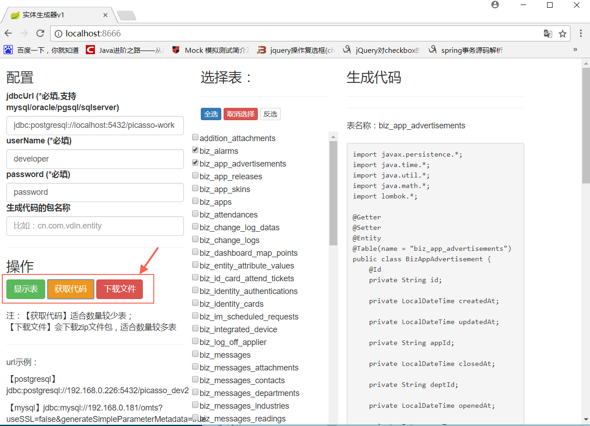

Java实体生成器

# 使用
1.clone到本地。
```
git clone https://github.com/chenjazz/EntityGenerator.git
```

2.使用命令行切换到该目录下，使用maven命令运行（确保本机安装了jdk8和maven）。
```
mvn spring-boot:run
```

3.启动成功后使用浏览器访问`http://localhost:8666/`，按照界面说明进行操作。


